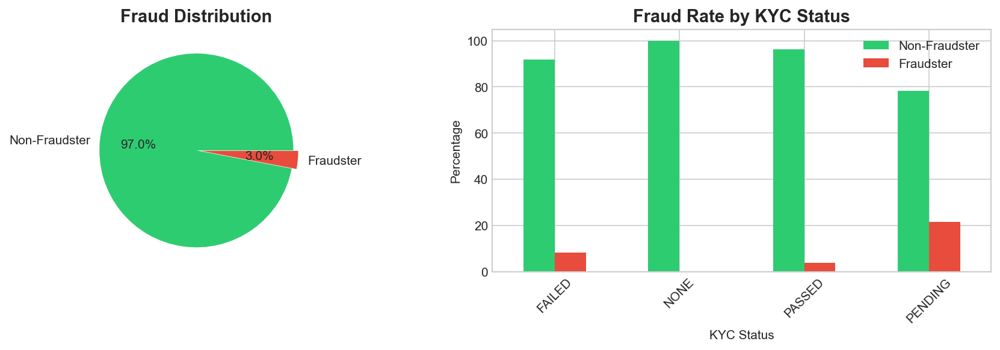
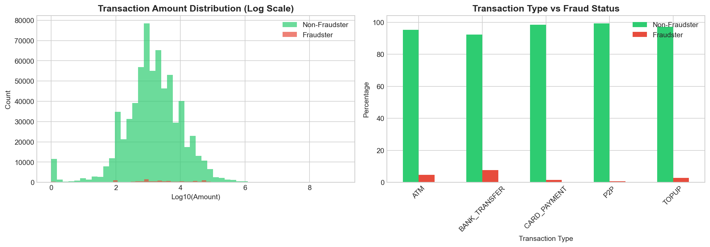
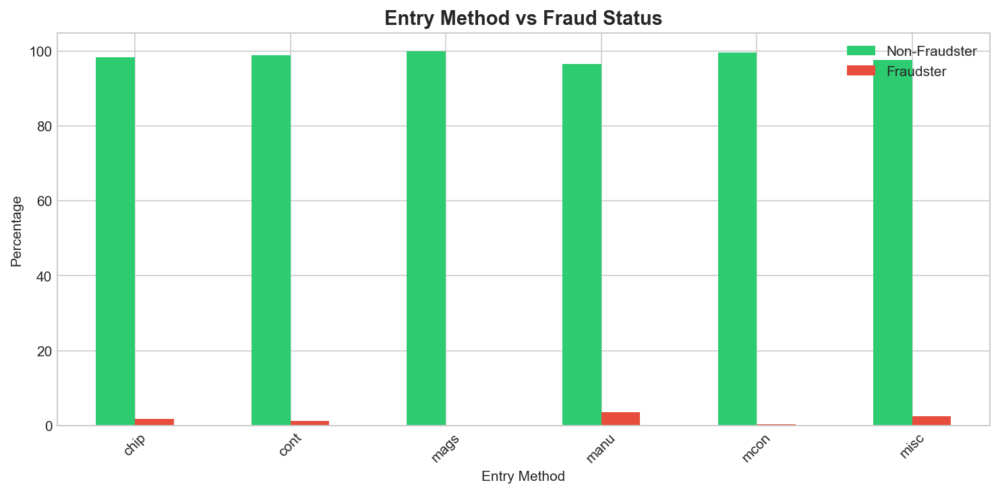
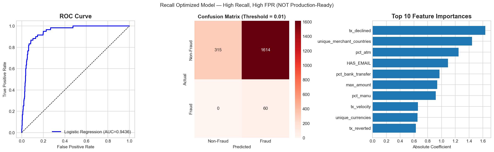

# 🔍 Fraudster Detection — Revolut Transaction Data

A machine learning project to identify fraudulent users from transaction and account data. The goal was to build a model that can flag potential fraudsters while keeping false alarms at a manageable level for operations teams.

---

## 📁 Project Structure

```
fraudsters_detection/
│
├── data/                          # Raw data files (gitignored)
│   ├── countries.csv
│   ├── currency_details.csv
│   ├── transactions.csv
│   └── users.csv
│
├── notebook/
│   └── fraudsters_detection.ipynb
│
├── visuals/
│   ├── 01_fraud_distribution_kyc.png
│   ├── 02_transaction_amount_type.png
│   ├── 03_entry_method.png
│   └── 04_recall_optimized_model.png
│
├── .gitignore
├── requirements.txt
└── README.md
```

---

## 📊 Dataset Overview

| Dataset | Rows | Description |
|---|---|---|
| `users.csv` | 9,944 | User accounts with KYC status, country, sign-in attempts |
| `transactions.csv` | 688,651 | Transaction records with amount, type, entry method, state |
| `countries.csv` | 226 | Country reference data |
| `currency_details.csv` | 184 | Currency details including crypto flags |

**Target variable:** `IS_FRAUDSTER` — 298 fraudsters out of 9,944 users (~3%)

---

## 🔎 Exploratory Data Analysis

### Class Imbalance & KYC Status



The dataset is heavily imbalanced — only 3% of users are fraudsters. KYC status is a meaningful signal: **PENDING** accounts have the highest fraud rate (~22%), while **NONE** accounts show almost zero fraud, likely because they are restricted from transacting.

> ⚠️ **Data leakage note:** The `STATE` column (ACTIVE/LOCKED) was excluded from all features. Accounts are locked *after* fraud is detected, making this a direct leak of the target variable.

---

### Transaction Behaviour



Fraudsters show distinct transaction patterns:
- **Higher transaction amounts** — average ~24,089 vs ~8,470 for non-fraudsters
- **Bank transfers** account for a much higher proportion of fraudster transactions — preferred for fast cash-out
- **ATM withdrawals** are also elevated among fraudsters

---

### Entry Method Analysis



**Manual entry (manu)** has the highest fraud rate among all entry methods. This makes sense — manual entry bypasses physical card verification, making it easier to use stolen card details.

---

## 🛠️ Feature Engineering

All transaction-level data was aggregated to the user level. A total of **33 features** were created across six categories:

| Category | Features | Reasoning |
|---|---|---|
| **User Profile** | age, account_age_days, kyc_score, HAS_EMAIL, phone_country_match, FAILED_SIGN_IN_ATTEMPTS | Newer accounts with incomplete KYC are higher risk. Phone/country mismatch is a red flag |
| **Transaction Volume** | tx_count, tx_completed, tx_declined, tx_failed, tx_reverted, tx_velocity | Fraudsters may show high velocity or many failed/declined attempts |
| **Transaction Outcomes** | decline_ratio, fail_ratio | High decline rates suggest card testing behaviour |
| **Amount Patterns** | avg_amount, max_amount, total_amount, std_amount | Fraudsters tend toward larger, more variable transactions |
| **Transaction Types** | pct_card_payment, pct_topup, pct_p2p, pct_atm, pct_bank_transfer | Bank transfers and ATM usage are preferred for cash-out |
| **Entry Methods** | pct_chip, pct_cont, pct_manu, pct_misc, pct_mags | Manual entry is the strongest entry-method fraud signal |
| **Diversity** | unique_merchant_categories, unique_merchant_countries, unique_currencies | Unusual diversity patterns may indicate suspicious activity |
| **Temporal** | avg_tx_hour, night_tx_ratio | Time-of-day patterns captured as a risk signal |

---

## 🤖 Modelling

### Models Trained
Three classification models were compared:
- **Logistic Regression** — interpretable baseline
- **Random Forest** — handles non-linear relationships
- **Gradient Boosting** — generally strong on structured tabular data

### Handling Class Imbalance
Initial models showed suspiciously perfect ROC-AUC scores. Investigation confirmed this was driven by severe class imbalance (97:3 ratio), not genuine model performance.

**Solution — Undersampling:** The majority class was undersampled on the training set only to create a 50-50 split (298 samples each). The test set was kept imbalanced to reflect real-world conditions.

The data was split into three sets:
- **Train** (balanced) → model fitting
- **Validation** (imbalanced) → threshold optimisation
- **Test** (imbalanced) → final evaluation

### Cross-Validation Results (Balanced Training Set)

| Model | CV ROC-AUC (mean ± std) |
|---|---|
| Logistic Regression | evaluated on balanced set |
| Random Forest | evaluated on balanced set |
| Gradient Boosting | **Best recall at default threshold** |

---

## 📈 Model Evaluation & Threshold Optimisation



The default classification threshold of 0.5 is rarely the right choice in fraud detection. Thresholds from 0.5 down to 0.01 were tested on the validation set to understand the recall vs. false alarm trade-off.

### Final Model Comparison

| Strategy | Model | Threshold | Recall | False Positive Rate | False Alarms |
|---|---|---|---|---|---|
| Recall Optimized | Logistic Regression | 0.01 | 100% | 84% | 1,594 |
| **Production-Ready** ✅ | **Random Forest** | **0.50** | **88%** | **12%** | **233** |

**Final choice: Random Forest at threshold = 0.50**

- 100% recall sounds ideal, but it flags 84% of legitimate users — operationally not viable
- 88% recall with 12% FPR is a realistic operating point, with missed cases handled by secondary controls

### Top Predictive Features
From the feature importance analysis, the top signals were:
1. `tx_declined` — declined transaction count
2. `unique_merchant_countries` — geographic spread of transactions
3. `pct_atm` — proportion of ATM transactions
4. `HAS_EMAIL` — whether the account has an email registered
5. `pct_bank_transfer` — proportion of bank transfer transactions

All five are consistent with what the EDA revealed — behavioural features were more predictive than static user attributes.

---

## 💡 Recommendations

**1. Use the model as a first filter, not the final decision**
The ML model should flag suspicious accounts for review. Final decisions — especially account freezes — should involve a human review step or secondary rule-based checks.

**2. Set the threshold based on operational capacity**
The right threshold depends on how many cases the fraud team can review per day. At 0.50, the model generates ~233 false alarms on this dataset. In production, this number should be calibrated against team capacity.

**3. Add velocity rules as a secondary layer**
Several top features (tx_declined, tx_velocity) suggest that rule-based velocity checks — e.g., flagging accounts with more than N declined transactions in 24 hours — could work well alongside the model.

**4. Monitor the `unique_merchant_countries` feature carefully**
High merchant country diversity is a fraud signal in this dataset, but it can also describe legitimate travellers. In production, this feature should be monitored for false positive bias against certain user segments.

**5. Revisit the model as more labelled fraud data accumulates**
With only 298 confirmed fraudsters, the minority class is small. As more labelled cases become available, retraining with a larger fraud sample will improve precision and allow for more refined threshold tuning.

**6. Consider adding time-based features in future iterations**
The current temporal features (avg_tx_hour, night_tx_ratio) are basic. More granular features — like transaction bursts within a short time window — could add predictive value.

---

## 🧰 Tech Stack


---

## ▶️ How to Run

1. Clone the repository
2. Place the four CSV files in a `data/` folder at the project root (this folder is gitignored — data is not committed)
3. Install dependencies:
   ```bash
   pip install pandas numpy matplotlib seaborn scikit-learn imbalanced-learn
   ```
4. Open and run `notebook/fraudsters_detection.ipynb` from top to bottom

---

## 👤 Author

**Mohit** — Data Analyst  
MSc Data Science & Computational Intelligence, Coventry University  
[LinkedIn](#) · [GitHub](#)
